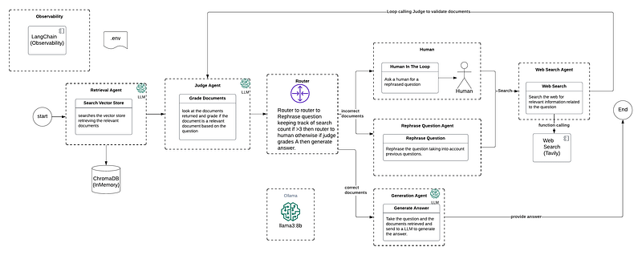

## Corrective RAG

This is an example of Corective Retrieval Augment Generation (GRAG).  This example performs a search against a 
Vector Database to find relevant documents and uses a Judge to determine if the documents are relevant to the question.
The Judge sends the response to a Router that will determine if it needs to route to the Rephraser Agent to rephrase the question
or if the Correct RAG has already tried search more than 3 times even after rephrase the question it needs to ask a human to rephrase the question before
performing another search.  Every Web Search is sent to the Judge to grade the documents for relevancy.  This is the multi step agentic workflow.  
If the Judge grades the document as a high relevant document related to the question, then the router sends this to the Generation Agent
to generate the answer which is the final result.

This example uses LangGraph to construct a graph to the various agents and also uses a GraphState to keep track of session information that is passed across agents such
as Question, Previous Question, Search Counts, and so on.  This example also uses LangGraph to provide the observability to track what each agent is doing.



## Initial Setup
This example uses Ollama to run a local model.  This also uses LangGraph to handle the workflow management of Agents.  Along this LangSmith is used to track Observability to see each step of what an Agent is performing.  Last this example uses the Tavily search tool to search the web for relevant documents.  Below are the setups needed.

1. Install Ollama
https://ollama.com/download

2. Install local Llama3
```ollama run llama3.1:8b```

3. Setup Tavily.  This is a search engine that you can connect your LLM to search the web.
https://tavily.com/
Get an API Key and store this in a .env

4. Langsmith register for an account
https://smith.langchain.com/
```
LANGCHAIN_TRACING_V2=true
LANGCHAIN_ENDPOINT="https://api.smith.langchain.com"
LANGCHAIN_API_KEY="<your-api-key>"
LANGCHAIN_PROJECT="pr-timely-asphalt-92"
```

5. run poetry install to build a virtual environment (how to install poetry https://python-poetry.org/docs/)
```
poetry install 
```

6. Select the Kernel env that will be the virtual environment created by poetry 

7. run each cell one by one.  You can change the question below in the last cell to experiment with this example and even try different documents. 